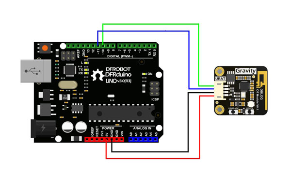

# ObloqAdafruit

Hacky library to work with Oblock module and Adafruit servers faking mqtt with http requests.

## Usage

Connect Obloq module as the following diagram.

 

Create an account at [io.adafruit.com](https://io.adafruit.com) and create some feeds.

Then, try some of the examples provided.
