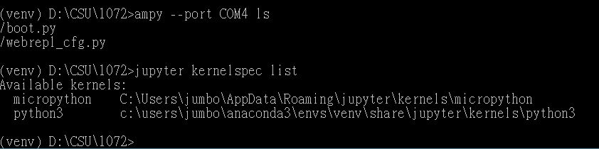
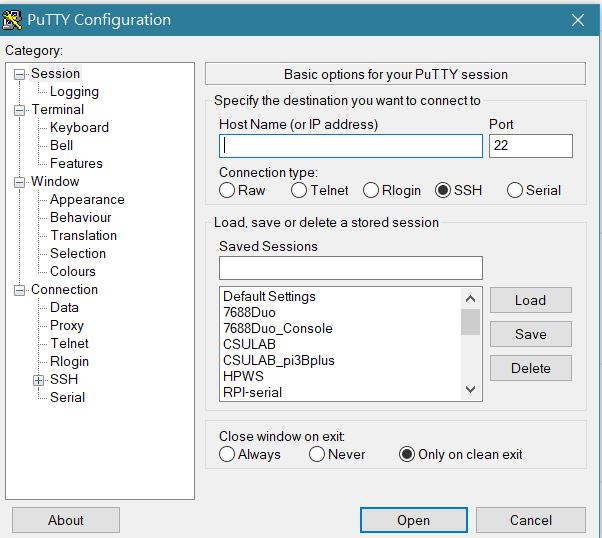
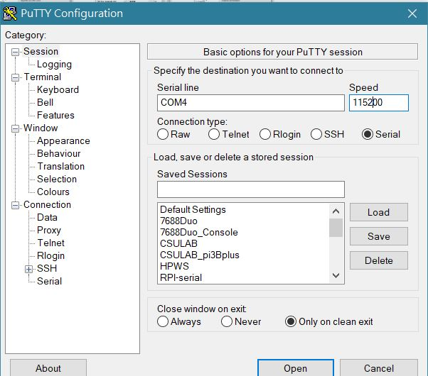

## 參考: [Micropython 基礎教程](http://www.1zlab.com/wiki/micropython-esp32/)
## Micropython 安裝程序
#
### 工具程式：
* [anaconda](https://www.anaconda.com/distribution/)
* [putty 終端機程式](https://www.chiark.greenend.org.uk/~sgtatham/putty/latest.html)
* [Micropython Kernel](https://github.com/goatchurchprime/jupyter_micropython_kernel.git)
* [git bash](https://git-scm.com/download/win)
* [驅動程式](https://github.com/jumbokh/micropython_class/blob/master/CP210x_Windows_Drivers_with_Serial_Enumeration.zip)
* [windows platform SDK](https://github.com/jumbokh/micropython_class/blob/master/Install/NDP46-KB3045560-Web.zip)
#
### 基本檔案：
* [boot.py](https://github.com/jumbokh/micropython_class/blob/master/Install/boot.py)
* [main.py](https://github.com/jumbokh/micropython_class/blob/master/Install/main.py)
* [webtool.html](https://github.com/jumbokh/micropython_class/blob/master/Install/webtool.html)
#
### 安裝步驟：
* 下載及安裝工具程式
* 下載[韌體檔案](https://micropython.org/resources/firmware/esp32-idf3-20191109-v1.11-571-g7e374d231.bin)
*  以 esptool 燒錄韌體
*  執行 "WinPython Command Prompt.exe"
*  接上 esp32 到電腦的 usb埠，檢查裝置管理員，如圖：[裝置管理員](images/windevice.JPG)
*  按住模組上的 flash 鍵 (一個是en鍵,一個是flash鍵), 待開始執行後放開
*  執行: 
esptool --port COM5 --chip esp32 erase_flash
esptool --chip esp32 --port COM5 write_flash -z 0x1000 esp32-idf3-20191109-v1.11-571-g7e374d231.bin
* 或執行 go
* 在瀏覽器中的 jupyter notebook 執行 rebuild.ipynb
#
### 燒錄不成功時，清空 flash (在 anaconda prompt 中執行)
### 相關模組
* python -m pip install --upgrade pip
* pip install pyserial esptool
* python -m esptool --port COM5 erase_flash
#
### [打包好的winpython](https://drive.google.com/open?id=1JjDOW1SdlqrCXyX2vjAydp3E2eedKtsI)
###  [kernel 參考](https://github.com/maloyang/20181116_smart-car/blob/master/smart-car-workshop.ipynb)
#
### 佈建Windows執行環境
* conda create -n venv python=3.5
* activate venv
* mkdir micropython
* cd micropython
* pip install numpy matplotlib pyserial
* python -m pip install --upgrade pip
* pip install adafruit-ampy jupyter
* git clone https://github.com/goatchurchprime/jupyter_micropython_kernel.git
* pip install -e jupyter_micropython_kernel
* jupyter kernelspec list

#
### test：
* putty 終端機
### 開啟putty

### 設定連接埠

### 連接
### 嘗試按 CTRL-C
### 出現提示符號
### >>> 
### >>> import uos
### >>> uos.uname()
#
* ampy test:
### ampy --port COM5 ls

#
* 設定 webrepl
### MicroPython esp32-idf3-20191109-v1.11-571-g7e374d231
### Type "help()" for more information.
### >>> import webrepl_setup
### WebREPL daemon auto-start status: disabled
###
### Would you like to (E)nable or (D)isable it running on boot?
### (Empty line to quit)
### > e
### To enable WebREPL, you must set password for it
### New password (4-9 chars): 1234
### Confirm password: 1234
### Changes will be activated after reboot
### Would you like to reboot now? (y/n)
### >>> import webrepl
### >>> webrepl.start()
#
* 設定網路
### >>> import network
### >>> sta = network.WLAN(network.STA_IF)
### >>> sta.active()    # 查看 wifi 是否啟動
### >>> sta.active(True)   # 啟動 wifi client
### >>> sta.scan()
### >>> sta.connect('Your-SSID', 'password')      #連線 AP (路由器)
### >>> sta.ifconfig()
#
### [參考](https://www.instructables.com/id/Micropython-on-ESP-Using-Jupyter/)
